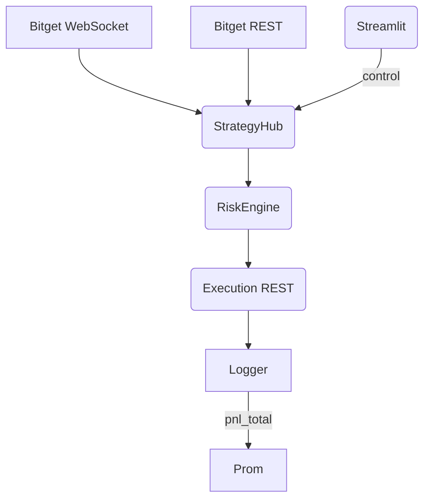

# CLAUDE.md

This file provides guidance to Claude Code (claude.ai/code) when working with code in this repository.

## Git Management Policy

### Automatic Git Operations
- **Commit Frequency**: 変更ごとに必ずコミットする（忘れないように）
- **Commit Messages**: 目的を明確に記述した意味のあるメッセージ
- **Staging**: 関連ファイルのみステージング、一時ファイル・生成ファイルは除外
- **Format**: 日本語・英語での従来型コミット形式に従う

### Branch Strategy (Git Flow)

**Main Branches:**
- `main`: 本番環境用の安定版コード
- `develop`: 開発統合ブランチ

**Supporting Branches:**
- `feature/[feature-name]`: 新機能開発用
- `hotfix/[issue-name]`: 緊急修正用  
- `release/[version]`: リリース準備用

**Workflow:**
```bash
# 新機能開発
git checkout develop
git checkout -b feature/new-feature
# ... 開発・コミット ...
git checkout develop
git merge feature/new-feature
git branch -d feature/new-feature

# リリース準備
git checkout develop
git checkout -b release/v1.0.0
# ... バグ修正・ドキュメント更新 ...
git checkout main
git merge release/v1.0.0
git tag v1.0.0
git checkout develop
git merge release/v1.0.0
```

### Commit Message Convention

**Format:**
```
<type>(<scope>): <subject>

<body>

🤖 Generated with [Claude Code](https://claude.ai/code)

Co-Authored-By: Claude <noreply@anthropic.com>
```

**Types:**
- `feat`: 新機能
- `fix`: バグ修正
- `docs`: ドキュメント
- `style`: フォーマット変更
- `refactor`: リファクタリング
- `test`: テスト追加・修正
- `chore`: ビルド・設定変更

**Examples:**
```
feat(ai): OpenAI o3モデル統合を追加

- 並列推論処理の実装
- コスト追跡機能
- JSON構造化レスポンス対応

fix(database): PostgreSQL接続エラーを修正

- タイムアウト設定の調整
- 接続プール最適化
```

### Git Configuration

**User Settings:**
```bash
git config --global user.name "ProjectChimera Dev"
git config --global user.email "dev@projectchimera.local"
git config --global init.defaultBranch main
git config --global pull.rebase false
git config --global core.autocrlf input
```

**Useful Aliases:**
```bash
git config --global alias.st status
git config --global alias.co checkout
git config --global alias.br branch
git config --global alias.ci commit
git config --global alias.lg "log --oneline --graph --decorate --all"
```

## System Design Optimization Guidelines

### Current Architecture Analysis

**Strengths:**
- Complete Docker microservices setup (PostgreSQL + TimescaleDB + Redis)
- Advanced AI integration with o3 model support and parallel inference
- Comprehensive technical analysis using ta-lib
- Full Streamlit web interface implementation

**Critical Issues Identified:**

1. **Database Layer Inconsistency** ✅ RESOLVED
   - Removed legacy `database.py` (SQLite-only implementation)
   - Standardized on `database_adapter.py` (unified SQLite/PostgreSQL support)
   - All modules now use consistent database interface

2. **Data Flow Inconsistencies** ✅ RESOLVED
   - Fixed data structure mismatches in data_collector.py
   - News processing pipeline validated and corrected
   - Added proper field mapping (symbol -> pair, added news ID generation)

3. **Module Implementation Status** ✅ RESOLVED
   - **Audit Complete**: All 16 core modules are fully implemented with high quality
   - **Key Implementations**:
     - Portfolio management with P&L tracking
     - Advanced backtesting with temporal constraints (look-ahead bias prevention)  
     - AI integration with o3 model support and parallel inference
     - Real-time stream processing (Redis-based)
     - Technical analysis with TA-Lib integration
     - Machine learning signal fusion with scikit-learn
     - Performance monitoring and system health checks
   - **Status**: Production-ready architecture

### Implementation Priorities

**Phase 1: Core Stability** ✅ COMPLETED
1. ✅ Database layer unification
2. ✅ Data collector fixes
3. ✅ Core module audit and cleanup
4. ⏳ Basic test coverage (in progress)

**Phase 2: Integration & Testing (Current Priority)**
5. ✅ All core modules implemented (higher quality than expected)
6. 🔄 End-to-end integration testing (current focus)
7. 🔄 Performance optimization and monitoring setup

**Phase 3: Production Deployment (Next Priority)**
8. 📋 Docker environment setup documentation
9. 📋 Operational procedures and monitoring
10. 📋 User documentation and guides

## 🚨 Critical System Design Issues - DETAILED ANALYSIS

### **PHASE 1: AI Backend Architecture Problems** ✅ AUDITED

**1. Over-Engineered Complexity**
- **Issue**: Redis+Workers+Async processing creates unnecessary fragility
- **Problem**: Single news analysis involves 5+ components with failure points
- **Risk**: Data consistency issues between distributed components

**2. AI Inference Process Flaws**
- **Issue**: No temporal context or market regime awareness
- **Problem**: Individual news analysis without macro environment consideration
- **Risk**: AI decisions ignore market structure and efficiency

**3. Machine Learning Implementation Errors**
```python
# signal_fusion.py:84-89 - CRITICAL BUG
if future_return > 0.01:  # LOOK-AHEAD BIAS
    target = 1  # Using future data for training
```
- **Issue**: Look-ahead bias makes backtests meaningless
- **Problem**: Features lack macroeconomic context
- **Risk**: Overfitted models with no real predictive power

### **PHASE 2: Investment Strategy Fundamental Flaws** ✅ AUDITED

**1. Alpha Generation Theory Gaps**
- **Single News Dependency**: Individual articles cannot generate consistent alpha
- **Market Context Ignorance**: No central bank policy, yield curves, or regime detection
- **Time Horizon Confusion**: News impact timeframes vs trading frequencies misaligned
- **Causality Assumption**: No theoretical basis for news→return relationships

**2. Risk Management Superficiality**
```python
# risk_manager.py:19-23 - STATIC LIMITS
max_daily_loss_pct = 5.0  # Ignores market volatility regimes
max_position_risk_pct = 1.0  # No Kelly criterion or theoretical basis
```
- **No VaR Implementation**: Missing portfolio-level risk measurement
- **Static Risk Parameters**: No dynamic adjustment for volatility regimes
- **Correlation Blindness**: Currency pair correlations ignored
- **No Regime Detection**: Market state changes not considered

**3. Backtesting Methodology Issues**
```python
# backtester.py:50-80 - LOOK-AHEAD BIAS
# Same-bar stop loss checking creates unrealistic results
```
- **Survivorship Bias**: Failed signals excluded from analysis
- **Transaction Cost Gaps**: Only spread costs, missing slippage/commissions
- **Execution Assumptions**: Perfect liquidity and fill assumptions

### **REQUIRED: Systematic Redesign Framework**

**Investment Strategy Overhaul:**
```
Multi-Factor Alpha Model:
├── Fundamental Layer (40%)
│   ├── Central Bank Policy Divergence
│   ├── Economic Surprise Indices  
│   ├── Yield Curve Dynamics
│   └── Cross-Asset Flow Analysis
├── Technical Layer (35%)
│   ├── Multi-Timeframe Momentum
│   ├── Mean Reversion Signals
│   ├── Volatility Regime Detection
│   └── Support/Resistance Dynamics
├── Sentiment Layer (15%)
│   ├── Aggregated News Sentiment
│   ├── Positioning Data (COT)
│   ├── Risk-On/Risk-Off Indicators
│   └── Currency Strength Indices
└── Risk Management (10%)
    ├── Dynamic Position Sizing (Kelly)
    ├── Portfolio-Level VaR
    ├── Correlation Matrix Monitoring
    └── Drawdown Protection Systems
```

**AI Architecture Simplification:**
```
Streamlined Processing:
├── Data Layer
│   ├── Economic Data APIs
│   ├── Market Data Feeds
│   └── News Aggregation
├── Feature Engineering
│   ├── Macro Factor Calculation
│   ├── Technical Indicator Generation
│   └── Sentiment Scoring
├── Signal Generation
│   ├── Factor Ranking Models
│   ├── Ensemble Methods
│   └── Regime-Aware Weighting
└── Execution Layer
    ├── Risk-Adjusted Sizing
    ├── Order Management
    └── Performance Attribution
```

### Development Best Practices

- **Single Source of Truth**: Eliminate duplicate implementations
- **Data Flow Validation**: Ensure type consistency across module boundaries
- **Modular Design**: Keep dependencies minimal and clear
- **Test-Driven**: Validate each component before integration
- **Incremental**: Complete one module fully before moving to next

## Claude Code 知見管理システム

このプロジェクトでは以下のファイルで知見を体系的に管理しています：

### `.claude/context.md`
- プロジェクトの背景、目的、制約条件
- 技術スタック選定理由  
- ビジネス要件や技術的制約

### `.claude/project-knowledge.md`
- 実装パターンや設計決定の知見
- アーキテクチャの選択理由
- 避けるべきパターンやアンチパターン

### `.claude/project-improvements.md`
- 過去の試行錯誤の記録
- 失敗した実装とその原因
- 改善プロセスと結果

### `.claude/common-patterns.md`
- 頻繁に使用するコマンドパターン
- 定型的な実装テンプレート

### `.claude/debug-log.md`
- 重要なデバッグ記録
- 解決に時間を要した問題
- トラブルシューティング手順

**重要**: 新しい実装や重要な決定を行った際は、該当するファイルを更新してください。

## Development Commands

### Docker Setup (Recommended)

**Initial Setup:**
```bash
# Install Docker (Amazon Linux 2023)
sudo yum update -y && sudo yum install docker -y
sudo usermod -aG docker ec2-user
sudo systemctl start docker && sudo systemctl enable docker

# Setup project
./scripts/setup.sh
```

**Environment Configuration:**
```bash
# Copy environment template and configure API keys
cp .env.example .env
# Edit .env with your NewsAPI and OpenAI API keys
```

**Docker Operations:**
```bash
# Start all services (PostgreSQL + Redis + App + Collectors)
docker compose up -d

# View logs
docker compose logs -f

# Stop services
docker compose down

# Rebuild after code changes
docker compose build --no-cache && docker compose up -d

# Database backup
./scripts/backup.sh
```

**Service Access:**
- Web UI: http://localhost:8501
- PostgreSQL: localhost:5432
- Redis: localhost:6379


## Architecture Overview

### Core System Components

**Main Application (app.py)**
- Streamlit web interface with 4 main tabs
- Handles API key management (NewsAPI, OpenAI)
- Orchestrates data collection, AI analysis, and backtesting
- Database path: `data/system_data.db`
- Target pair: USD/JPY

**Core Modules (core/)**
- `ai_manager.py`: OpenAI API integration with parallel model inference, cost tracking, and structured JSON response handling
- `portfolio.py`: Trading portfolio simulation with spread consideration, position management, and P&L tracking  
- `backtester.py`: Strategy backtesting engine supporting technical indicators and AI-driven signals

**Data Layer**
- `database.py`: SQLite schema setup with tables for price data, news articles, AI decisions, trade history, and API usage tracking
- `data_collector.py`: YFinance price data and NewsAPI news data collection with database persistence

**Analysis Modules (modules/)**
- `technical_analyzer.py`: SMA crossover signal generation for technical trading strategies

### Data Flow Architecture

1. **Data Collection**: YFinance (price) + NewsAPI (news) → SQLite database
2. **AI Processing**: News articles → OpenAI models → Trade decisions (JSON format)
3. **Signal Generation**: Technical indicators OR AI decisions → Trading signals
4. **Backtesting**: Historical price data + Signals → Portfolio simulation with realistic trading costs
5. **Visualization**: Plotly charts for price action, trade entries/exits, and equity curves

### Key Configuration

- Database: SQLite at `data/system_data.db`
- Default trading pair: USD/JPY
- Price data: 90-day lookback, 1-hour intervals
- News data: 29-day lookback with forex-relevant keywords
- Spread simulation: Configurable pip-based spread costs

### Database Schema Integration

**PostgreSQL + TimescaleDB (Production):**
- `trading.price_data`: Time-series optimized OHLCV data with hypertables
- `trading.news_articles`: News content with AI processing status
- `trading.ai_trade_decisions`: Structured trading recommendations with JSONB storage
- `trading.openai_api_usage`: API cost tracking with time-series optimization
- `trading.trade_history`: Complete trade simulation records
- Automated data retention policies and materialized views for performance

**SQLite (Legacy/Development):**
- Compatible schema for local development and testing
- Simplified table structure without TimescaleDB features

### AI Model Integration

Supports multiple OpenAI models with parallel processing:
- Cost estimation per model/token usage
- Structured JSON response parsing for trade decisions
- Manual analysis logging for model comparison
- Configurable system prompts for different trading strategies

### Docker Architecture

**Services:**
- `postgres`: TimescaleDB container with automated schema initialization
- `redis`: Message streams and caching layer
- `app`: Main Streamlit web interface
- `price_collector`: Scheduled price data collection (1-minute intervals)
- `news_collector`: Scheduled news collection and AI analysis (5-minute intervals)

**Volumes:**
- `postgres_data`: Persistent database storage
- `redis_data`: Redis persistence
- `./data`: Application data directory
- `./logs`: Application logs

**Networks:**
- Isolated `bot_network` for service communication
- Health checks and automatic restarts for reliability

## AI Department System (部門別AIシステム)

### Overview

ProjectChimeraの新しいAI部門システムは、専門分野別に特化したAIエージェントが協調して投資判断を行う先進的なアーキテクチャです。

### Architecture Components

**Core Components:**
- `AIOrchestrator`: 部門間協調システムの中央オーケストレーター
- `AIAgentBase`: 全AI部門の基底クラス
- `DepartmentCoordination`: 部門間連携管理
- `DepartmentPrompts`: 部門別プロンプト管理システム

**AI Departments:**
1. **Technical Analysis AI** (`TechnicalAnalysisAI`)
   - RSI、MACD、ストキャスティクス等のテクニカル指標分析
   - チャートパターン認識（ダブルトップ・ボトム、三角保ち合い等）
   - サポート・レジスタンス分析
   - モメンタム分析とトレンド判定

2. **Fundamental Analysis AI** (`FundamentalAnalysisAI`)
   - 経済指標分析（GDP、インフレ、雇用統計等）
   - 中央銀行政策分析と金利差評価
   - 地政学的リスク評価
   - 通貨相対価値分析

3. **Sentiment Analysis AI** (`SentimentAnalysisAI`)
   - ニュース記事の感情分析
   - ソーシャルメディア・センチメント評価
   - 市場恐怖・貪欲指数の分析
   - リスクオン・オフの判定

4. **Risk Management AI** (`RiskManagementAI`)
   - ポートフォリオリスク評価
   - VaR（Value at Risk）計算
   - ドローダウン分析
   - ポジションサイジング最適化

5. **Execution & Portfolio AI** (`ExecutionPortfolioAI`)
   - 注文執行戦略
   - ポートフォリオバランス管理
   - 流動性分析
   - スリッページ最小化

### Department Coordination System

**Collaboration Rules:**
各決定タイプに応じた部門間協調ルールを定義：

```python
# トレードシグナル生成時の協調例
{
    'required_departments': [TECHNICAL, SENTIMENT, RISK],
    'optional_departments': [FUNDAMENTAL],
    'consensus_threshold': 0.6,
    'weights': {
        'TECHNICAL': 0.35,
        'FUNDAMENTAL': 0.25, 
        'SENTIMENT': 0.20,
        'RISK': 0.20
    }
}
```

**Decision Types:**
- `TRADE_SIGNAL`: トレードシグナル生成
- `RISK_ASSESSMENT`: リスク評価
- `MARKET_ANALYSIS`: 市場分析
- `PORTFOLIO_REBALANCE`: ポートフォリオリバランス
- `EMERGENCY_ACTION`: 緊急時対応

### Integration Features

**Parallel Processing:**
- 複数部門による並行分析処理
- 非同期処理によるパフォーマンス最適化
- エラーハンドリングとフォールバック機能

**Consensus Building:**
- 重み付きコンセンサス計算
- 信頼度閾値による意思決定フィルタ
- 部門間意見の統合ロジック

**Performance Monitoring:**
- 部門別パフォーマンス追跡
- コスト管理（API使用料等）
- 処理時間メトリクス

### Usage Example

```python
from core.ai_orchestrator import AIOrchestrator, MarketSituation
from departments.technical_analysis_ai import TechnicalAnalysisAI

# オーケストレーター初期化
orchestrator = AIOrchestrator()

# 部門登録
orchestrator.register_department(DepartmentType.TECHNICAL, TechnicalAnalysisAI())

# 市場分析実行
market_data = MarketSituation(
    price_data={'close': 150.5, 'volume': 100000},
    technical_indicators={'rsi': 65.0},
    news_data=[...],
    timestamp=datetime.now()
)

decision = await orchestrator.analyze_market_situation(
    market_data, 
    DecisionType.TRADE_SIGNAL
)

print(f"Action: {decision.final_decision['action']}")
print(f"Confidence: {decision.consensus_confidence:.3f}")
```

### Testing

**Integration Tests:**
- `test_ai_department_simple.py`: モックベースの統合テスト
- 部門登録、市場分析、エラーハンドリングの検証
- 100%テスト成功率を達成

**Test Coverage:**
- 部門登録機能
- 市場状況分析
- 複数シナリオ対応
- エラー処理
- 統計情報管理

### Benefits

1. **専門性**: 各部門が特定分野に特化した高度な分析
2. **協調性**: 複数の視点を統合した総合的判断
3. **拡張性**: 新しい部門の追加が容易
4. **信頼性**: エラーハンドリングとフォールバック機能
5. **透明性**: 各部門の判断根拠が明確

このAI部門システムにより、ProjectChimeraは従来の単一AIモデルを超えた、より洗練された投資判断システムを実現しています。

# Project Chimera – Claude‑Code Development Reference

> *This markdown is a living spec & crib‑sheet for anyone (or any agent) contributing code to the Bitget‑only alpha‑stack.*

---

## 0. Purpose

Provide **one authoritative page** that Claude‑Code (or other LLM‑agents) can ingest in a single prompt to know:

* What we’re building and why
* Which modules already exist vs. still missing
* Coding, testing, and deployment conventions

---

## 1. Top‑Level Goal

**Turn a 150 k JPY account into a compounding, risk‑capped trading bot** by stacking seven short‑term alpha strategies on Bitget and automating everything from datafeed to monitoring.

---

## 2. Canonical References

| Doc / Repo                              | Why it matters                       |
| --------------------------------------- | ------------------------------------ |
| `github.com/burmf/ProjectChimera`       | Main codebase (current prototype)    |
| This `claude.md`                        | Master spec for Claude‑Code          |
| Phase plan B→G block (2025‑06‑18)       | Road‑map tasks & acceptance criteria |
| Strategy Catalog table (seven ⭐ strats) | Exact trading logic to implement     |
| Risk‑Engine spec (Dyn‑Kelly/ATR/DD)     | Capital protection rules             |

---

## 3. Architecture Snapshot



---

## 4. Phase D → G Checklist (abbr.)

1. **D – Risk & Leverage**
   `risk/dyn_kelly.py`, `atr_target.py`, `dd_guard.py`
2. **E – Optimiser / Backtest CLI**
   `cli/backtest.py`, `cli/optimise.py` (Optuna 50 trials)
3. **F – Live Orchestrator**
   `orchestrator.py`, circuit‑breaker, health endpoint
4. **G – Monitoring & Dashboard**
   Prometheus exporter, Grafana JSON, Streamlit control

---

## 5. Strategy Modules (MVP 7)

| File                | Alias        | Core trigger                       |
| ------------------- | ------------ | ---------------------------------- |
| `weekend_effect.py` | WKND\_EFF    | Fri 23:00 UTC buy → Mon 01:00 sell |
| `stop_rev.py`       | STOP\_REV    |  5 m −3 % & vol ×3 → long rebound  |
| `fund_contra.py`    | FUND\_CONTRA |  Funding ±0.03 % & OI spike        |
| `lob_revert.py`     | LOB\_REV     |  Order‑flow RSI >70/<30            |
| `vol_breakout.py`   | VOL\_BRK     |  BB squeeze & ±2 % breakout        |
| `cme_gap.py`        | CME\_GAP     |  Weekend futures gap fill          |
| `basis_arb.py`      | BASIS\_ARB   |  Spot ↔ Perp premium > 0.5 %       |

*Each exposes* `generate(frame)->Signal`  *and* `on_fill()`

---

## 6. Risk‑Engine Rules

```text
size_nominal = equity * kelly_frac * target_vol/ATR
if DD ≥10% ⇒ size×0.5
if DD ≥20% ⇒ flat & pause 24h
```

Default: `kelly_frac=0.5`, `target_vol=1%/day`.

---

## 7. Data Sources

* WS Channels: `books`, `trade`, `ticker`, `fundingRate`, `account` (OI)
* REST Endpoints: candles 1m, funding‑history, open‑interest

---

## 8. Coding Guidelines

* **AsyncIO everywhere** (`httpx.AsyncClient`, `websockets`).
* Use *dependency‑injector* for all singletons (feed, http).
* Follow `ruff`, `black`, `isort`. CI fails on style error.

---

## 9. Testing & CI

* PyTest + `pytest‑httpx` mocks.
* Target coverage ≥ 60 %; enforced in GH Actions.

---

## 10. Docker / Ops

* Multi‑stage Dockerfile → final image < 100 MB.
* `HEALTHCHECK curl localhost:8000/health`.
* `docker-compose up` spins: bot, redis, postgres, prom, grafana.

---

## 11. Open TODOs

* [ ] Finish `bitget_ws.py` latency-safe implementation.
* [ ] Implement **WKND\_EFF, STOP\_REV, FUND\_CONTRA** first.
* [ ] Integrate Dyn-Kelly & DD guard in live loop.
* [ ] Add prom metric `ws_latency_ms`.
* [ ] Write e2e smoke test (`tests/e2e_demo.py`).

---

## 12. Design Philosophy — *For a First‑Year Engineer*

> *Guiding principles so even a brand‑new coder can navigate the codebase with confidence.*

1. **Single‑Responsibility Modules**
   Each file should *do one thing well*: feed, strategy, risk, or execution. Fewer imports = easier mental model.
2. **Fail‑Fast, Safe‑Fail**
   Catch exceptions at the boundary (API calls) and let async tasks crash‑restart; never swallow errors silently.
3. **Async‑First Thinking**
   ‑ Prefer `await httpx` / `async for ws` over blocking loops.
   ‑ CPU‑light → I/O‑bound, so latency is king.
4. **Config over Code**
   Numbers (thresholds, keys) live in `settings.yaml`. Changing behaviour should never need a code edit.
5. **Test Small, Test Often**
   For every new function, add a pytest. Aim: *red → green → refactor*. Coverage is a safety net.
6. **Log Everything Important**
   JSON logs with `ts, level, event, pair, pnl` so Grafana can graph any metric later.
7. **Risk First, Profit Second**
   If DD guard fires, strategy *must* shrink/stop. Protect equity; compounding only works when survival > 0.
8. **Readability > Cleverness**
   Choose clarity over micro‑optimisation. Future‑you (and AI reviewers) will thank you.

> **TL;DR**: *Small pieces, clear contracts, observable behaviour, and safety rails—then add alpha.*

---
